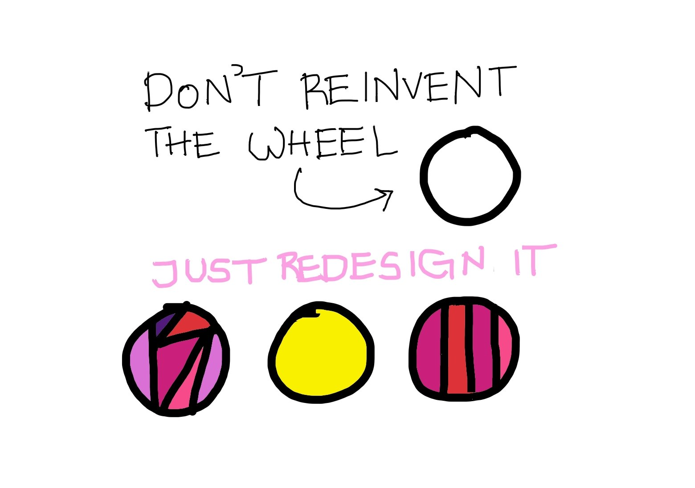

# Patterns

## Introduction

When developing an application or system, **design patterns** are the best, established approaches a programmer may apply to handle common challenges.

**Design patterns** can help developers save time by providing tried-and-true development paradigms.

**Design patterns** are solutions to recurring problems; guidelines on how to tackle certain problems. They are not classes, packages or libraries that you can plug into your application and wait for the magic to happen.

### 😶⬆ Heads up

- **Design patterns aren't a panacea** 
- Do not try to compel them; if you do, awful things are bound to happen.
- They can be a lifesaver if used in the right place and in the right way, or they can be a disaster if used incorrectly.

## Objectives

- **You** want to improve **how** you develop
- **You** wish you could **have clear criteria for determining how to improve a software design proposal.**
- **You**  

## Table of Contents
1. [Design principles](01-principles/README.md)
2. [Design patterns: creational](02-creational/README.md)
3. [Design patterns: behavioral](03-behavioral/README.md)
4. [Design patterns: structural](04-structural/README.md)

## Getting started 

### Design patterns **advantages** 
  - They are reusable and can be used in multiple projects.
  - They provide template solutions.
  - They provide transparency to software design.
  - They are well-tested and proven means of developing robust solutions effortlessly.

### Design pattern vs design principles
  - ❓
  
### Design pattern vs architecture style
  - ❓ 

### Design pattern vs architecture pattern 🤔
  - ❓
  

## Resources

### books

- [Refactoring: Improving the design of existing code](https://www.amazon.es/Refactoring-Improving-Existing-Addison-wesley-Signature/dp/0134757599/ref=pd_bxgy_img_2/258-7702774-6814609?pd_rd_w=416Rg&pf_rd_p=6003b884-667d-4d91-a6f1-ce2e55c4ddc2&pf_rd_r=9KVKQ32VC69XWX3HR4W4&pd_rd_r=2037804f-83bb-4a9e-be18-1915761da7ce&pd_rd_wg=2uQWw&pd_rd_i=0134757599&psc=1)
- [The pragmatic programmer](https://www.amazon.es/Pragmatic-Programmer-journey-mastery-Anniversary/dp/0135957052/ref=sr_1_1?__mk_es_ES=%C3%85M%C3%85%C5%BD%C3%95%C3%91&crid=1OFSWA9O77PZT&keywords=The+Pragmatic+Programmer%3A+From+Journeyman+to+Master&qid=1647068867&sprefix=the+pragmatic+programmer+from+journeyman+to+master%2Caps%2C92&sr=8-1)
- [Clean Code](https://www.amazon.es/Clean-Code-Handbook-Software-Craftsmanship/dp/0132350882/ref=pd_bxgy_img_1/258-7702774-6814609?pd_rd_w=416Rg&pf_rd_p=6003b884-667d-4d91-a6f1-ce2e55c4ddc2&pf_rd_r=9KVKQ32VC69XWX3HR4W4&pd_rd_r=2037804f-83bb-4a9e-be18-1915761da7ce&pd_rd_wg=2uQWw&pd_rd_i=0132350882&psc=1)
- [Design patterns: Elements of Reusable Object-Oriented Software](https://www.amazon.com/Design-Patterns-Elements-Reusable-Object-Oriented/dp/0201633612)

### other

- [Refactoring guru](https://refactoring.guru/es/design-patterns)
- [Design patterns principles](https://java-design-patterns.com/principles/)
- [Programming principles](https://github.com/webpro/programming-principles)
- [Design patterns for humans](https://github.com/kamranahmedse/design-patterns-for-humans)
- [Java Design patterns (Web)](https://java-design-patterns.com/patterns/)
- [Java design patterns (GitHub)](https://github.com/iluwatar/java-design-patterns)

## License 

This project is licensed under the terms of the MIT license.